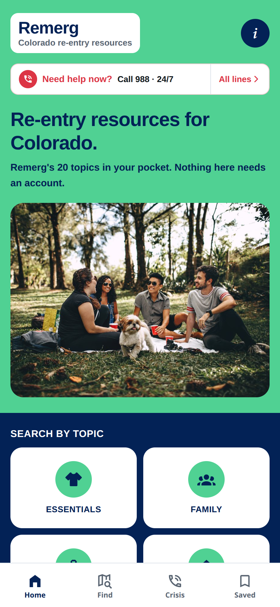

# Remerg Mobile

An Expo / React Native app built from [remerg.com](https://remerg.com/about/) — the Colorado
re-entry resource hub run by Remerg, a 501(c)(3) working to "stop the revolving door of
recidivism, one resource at a time."

> **Independent client.** This app is not published, endorsed by, or affiliated with Remerg. It was
> built against their public website. Hotline numbers were verified 18 September 2026.

<p align="center">
  
</p>

---

## What the site audit turned up

### Design system

The live theme is WordPress + Bootstrap 5 with the Bootstrap variables overridden:

| Token | Value | Source |
| --- | --- | --- |
| Primary (navy) | `#032256` | `--bs-primary: rgb(3, 34, 86)` |
| Secondary (mint) | `#50D193` | `--bs-secondary: rgb(80, 209, 147)` |
| Crisis red | `#DC3545` | Bootstrap `--bs-danger` ramp |
| Brand typeface | `aaux-next` | Adobe Typekit (`use.typekit.net`) |

Ported to `src/global.css` / `tailwind.config.js`. The app is light-only: every page is built from
three full-width bands in the site's colours — mint green (title), navy (content, white cards),
white (sources and extras) — which must not flip with the phone's dark mode. `aaux-next` is a licensed Typekit
face and is **not** bundled; the app uses system fonts, which is also the better accessibility
default. Swapping in a licensed copy is a `expo-font` call away.

### Integrated APIs and services

Found on the live site:

| Service | Detail | Used here |
| --- | --- | --- |
| WordPress REST | `/wp-json/wp/v2/{resources,map_categories}` | Yes — `src/lib/remerg.ts` |
| ACF | `/acf/v3/*` mirrors every post type | Field names honoured in the resource parser |
| AI Engine (Meow Apps) | `/mwai/v1/*`, OpenAI chat + realtime | No — needs a server-side key |
| Google Analytics | `G-FNQX45YW4V` | No — deliberately omitted, see Privacy |
| Constant Contact | `ctct_forms` post type | No |
| GTranslate | `cdn.gtranslate.net` | No — use native OS translation |
| Wordfence | Login security, 2FA REST routes | N/A |
| Transistor.fm | `hotlines-crj.transistor.fm` podcast | No |

### Subdomains — a false lead, documented so nobody re-runs it

`*.remerg.com` is a **wildcard DNS record** pointing at Google Cloud load balancers. Probing turns
up `app.`, `api.`, `map.`, `portal.`, `cdn.` and thirty more — but so does
`zzqx-not-a-real-host-9471.remerg.com`, and every one of them serves a byte-identical copy of the
main WordPress site. There is no separate app tier, API tier or CDN origin. Everything lives on one
host behind SiteGround's CDN.

### The data problem

`GET /wp/v2/resources?per_page=1` returns **`X-WP-Total: 0`**. The custom post type is registered
with the REST API and the route is advertised, but records are not readable anonymously — the site
renders them server-side behind a login. `map_categories` *is* public and returns all six terms.

This shaped the whole architecture: **bundled data is the source of truth, the network is an
enhancement.** `src/lib/remerg.ts` layers live data on top when it can and degrades silently when it
can't. The day Remerg exposes the CPT, `fetchResources()` starts returning rows and the UI fills in
with no other changes.

---

## What changed moving to mobile

The website is organised the way the *organisation* is organised. The app is organised the way a
person in crisis actually thinks.

1. **Crisis lines got promoted from a modal to a tab.** On the website they live inside a dialog you
   have to go find. A `CrisisBar` now sits on every primary screen: left half dials 988 instantly,
   right half opens the full list.
2. **The same topics as the website.** The home screen is remerg.com's 20 resource topics, in its
   order, with all 104 subtopics — ten up front, ten behind "Show more resources", as on the site.
   Each topic shows what the app carries for it (crisis lines, treatment facilities, halfway
   houses) and links to its full list on remerg.com. The 16 survey *needs* still drive the
   optional Personalize screen, and float the matching topics to the top.
3. **The signup wall came down.** The site gates its map behind registration. Here the survey is
   optional, skippable, and stored on-device only.
4. **Offline-first.** All 18 hotlines and 31 numbers ship in the binary.
5. **Maps in the app.** "Directions" opens an in-app map (`src/app/place.tsx`): a bird's-eye view
   of the place, a drive or walk route with turn-by-turn steps, and a 3D view of the building. It
   is a CesiumJS globe in an Expo DOM component, so the same map runs on web, iOS and Android.
   The phone's own maps app stays one tap away for voice navigation.

## Privacy

This audience has specific, well-founded reasons to distrust an app that profiles them.

- **No analytics.** The site's GA tag was deliberately not carried over.
- **No accounts, no network writes.** Nothing the user enters leaves the device.
- **Directions are the one exception, and only on request.** Tapping "Get directions" asks for the
  phone's location (falling back to a city-level IP estimate, labelled as approximate, and refused
  outright if it lands over 100 miles away). The start point goes to the OpenStreetMap routing
  service for that one route and is not stored.
- **Everything local.** Needs, justice status, age, ZIP and pins live in `AsyncStorage`.
- **One-tap erase** in the Saved tab wipes all of it.

`toSurveyPayload()` in `src/lib/profile.ts` maps the local profile onto the website's survey field
names for the day real accounts are wanted — as an explicit, separate opt-in.

---

## Running it

```bash
npm install
npx expo start        # then scan the QR code with Expo Go
```

```bash
npm run web           # browser
npm run tunnel        # Expo Go over a public tunnel (remote/NAT'd hosts)
npm run android
npm run ios           # macOS only
npm run typecheck
```

### In GitHub Codespaces

`.devcontainer/devcontainer.json` installs dependencies and forwards the ports, so a fresh
codespace is ready to run. Two ways to see the app:

**Browser (fastest).** Run `npm run web`, then open the forwarded **8081** URL from the Ports tab.
Codespaces gives it an `https://<codespace>-8081.app.github.dev` address. For a realistic view,
open browser devtools and switch on device emulation — this is a phone layout.

#### If you see `sh: 1: expo: not found`

`node_modules` isn't there yet. Either setup is still running, or it failed. Fix it in the
codespace terminal:

```bash
npm ci && npm run web
```

The devcontainer now uses `updateContentCommand` with `waitFor`, which holds the terminal until the
install finishes, so this shouldn't recur on a freshly rebuilt codespace. On an existing one, run
**Codespaces: Rebuild Container** from the Command Palette to pick up the change.

**Real phone via Expo Go (highest fidelity).** Plain `npx expo start` will not work: a codespace is
not on your wifi, so the phone cannot reach Metro on a LAN address. Use the tunnel instead:

```bash
npm run tunnel
```

`@expo/ngrok` is already a devDependency, so this needs no extra install. Scan the QR code with
Expo Go and the app loads over the public tunnel.

> To open the web URL on your phone rather than your laptop, set port 8081 to **Public** in the
> Ports tab first — forwarded ports are private to your GitHub account by default, and the phone
> browser will hit a login wall otherwise.

**3D view (optional).** The building view uses Google Photorealistic 3D Tiles through Cesium ion.
Put a token in a gitignored `.env.local` as `EXPO_PUBLIC_CESIUM_ION_TOKEN=...` and restart Expo.
Without it the map still works; the 3D button says 3D is unavailable. Note that `EXPO_PUBLIC_`
values are compiled into the app, so a published build needs a restricted token.

**What web mode will not show you:** `tel:` dialing, haptics, and the native maps handoff are all
no-ops in a browser. The layout, navigation, theming, offline data and filtering are all faithful —
but the single most important interaction in this app, one-tap calling, can only be verified on a
real device.

## Layout

```
src/
  app/
    _layout.tsx              Root stack + ProfileProvider
    (tabs)/
      index.tsx              Home — Remerg's 20 topics
      directory.tsx          The six map categories
      crisis.tsx             Hotlines, searchable + filterable
      saved.tsx              Pinned lines + privacy controls
    topic/[slug].tsx         One topic -> subtopics, hotlines, places, organisations
    place.tsx                In-app map: route, steps, 3D view
    category/[slug].tsx      One category -> live resources
    personalize.tsx          Optional local survey
    about.tsx                Mission, copied from remerg.com/about
  components/
    crisis-bar.tsx           The always-present safety net
    call-button.tsx          One tap = one call
    hotline-card.tsx
    topic-tile.tsx
    place-map.tsx            CesiumJS map ('use dom'), render-on-demand
    member-card.tsx          One organisation listing
    ui/band.tsx              The green / blue / white page bands
    ui/screen.tsx
  data/
    hotlines.ts              18 hotlines, 31 numbers — offline
    topics.ts                remerg.com's 20 topics and 104 subtopics
    taxonomy.ts              16 survey needs, 6 map categories, survey options
    members.ts               Remerg's organisation listings (empty in git)
  lib/
    remerg.ts                WP REST client, degrades gracefully
    dial.ts                  tel:, openPlace (in-app map), links
    navigation.ts            Location + routing for Directions
    profile.ts               Device-local storage
    profile-context.tsx
  constants/theme.ts         Brand tokens
```

## Known gaps

- **Remerg's own listings are not in git.** They sit behind a Remerg account, so
  `src/data/members.generated.json` is committed empty; publishing them needs Remerg's permission
  or an export. Topic screens say so and route users to remerg.com and 211.
- **Routing uses the free OpenStreetMap service** (routing.openstreetmap.de), fine for testing; a
  public launch needs a paid or self-hosted router.
- **`aaux-next` not bundled** — licensed Typekit font.
- **Hotlines are a point-in-time snapshot.** A `syncHotlines()` refresh path is the obvious next
  step once there's an endpoint to call.
